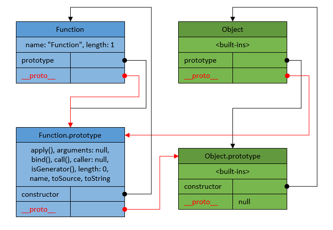
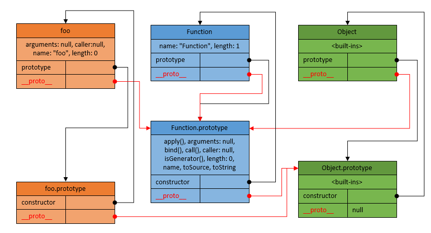
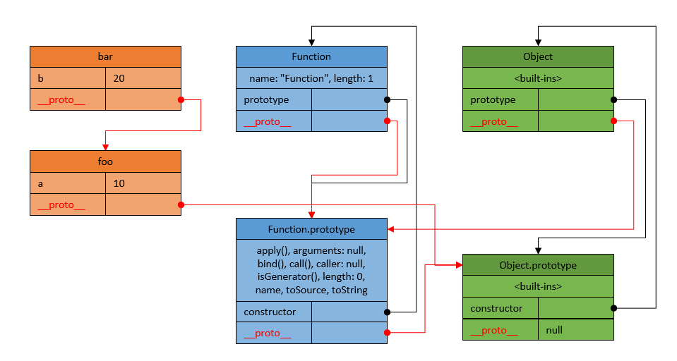
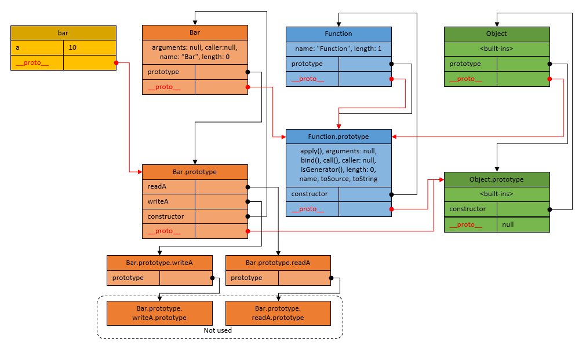
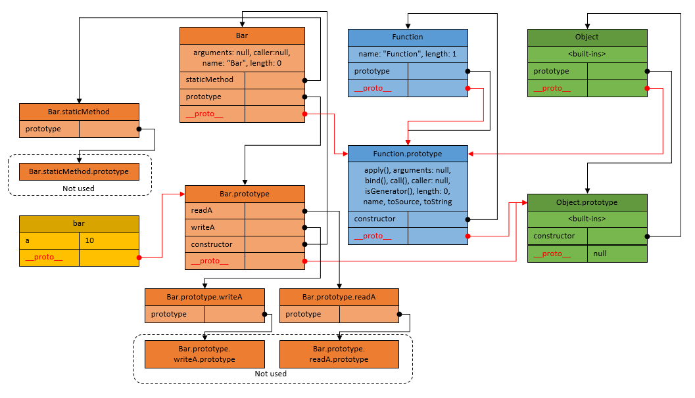
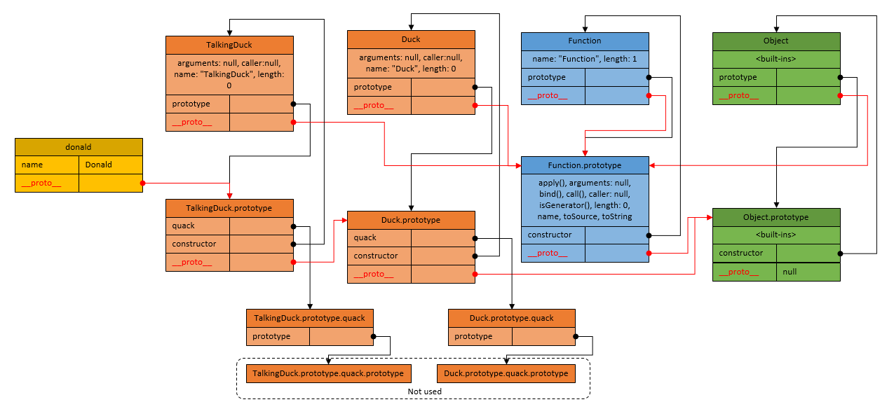

<a href="https://raw.githubusercontent.com/rus0000/jsinheritance/master/images/Function-Object.png" target="_blank"></a>
#### Objects
* In JavaScript we have functions and objects
* There is no `classes` and no `constructors` in a language. ES6 `class` is only a syntactical sugar
* There are no `methods` or `members` in an object, there are only `properties`
* Object property can hold a value or reference to another object or function
* Every object has a built-in `__proto__` property
* `__proto__` property correspond to internal, hidden `[[Prototype]]` property of the object
* `function` object and its `prototype` object, **both**, also have `__proto__` property
* `__proto__` property is standardized only in ES6. In ES5, existance of `__proto__` property depends on implementation. In ES5 standard way to access value of `[[Prototype]]` property is `Object.getPrototypeOf()` method
* In ES6 `__proto__` property can be set, it just holds reference to another object. In ES6 there is also a `Object.setPrototypeOf()` method
* It is possible to create object without `__proto__` property using `var obj = Object.create(null)`
* Object, which is referenced by `__proto__` property of a given object, is called its `parent`. That `parent` object can also have `__proto__` property to its own `parent`, thus forming `prototype chain`
* `prototype chain` of objects or `prototypal inheritance chain` is a way, how **inheritance** is implemented in JavaScript
* When JavaScript runtime looks for a property, with a given name, on an object, it first examines object itself, and then all objects down its prototype chain

#### Functions
* Functions are also objects, but of special type
* Every **function declaration** immediately creates **TWO OBJECTS**:
  * the `function` object itself
  * the `prototype` object, belonging to this function
  * That happens **before** any code execution even begins, just after code parsing
* `function` object can be accessed just using function name without parenthesis, for example `myFunction`
* `prototype` object can be accessed using `prototype` property of `function` object, for example `myFunction.prototype`
* Functions, which are intended to be used as constructors, just called `constructor functions`. Tey have to be invoked with a `new` keyword to construct a new object
* Any function can be invoked as a constructor, but this doesn't mean it *should* be invoked as a constructor
* By convention, constructor functions are named with `PascalCase`, all other functions are named with `camelCase`
* `prototype` object is used by JavaScript, when function is invoked as a `constructor` (with `new` keyword) to initialize newly constructed object `__proto__` property
* `prototype` object of `constructor function` is reminiscent of what is usually stored in `class` definition, in classical OOP languages like Java and C++
* `constructor function` and its `prototype` object are always come togehter
* `prototype` object does not used at all, if function is not intended to be used as a constructor

## Function in JavaScript
Having simple function declaration, we get following inheritance.
```javascript
function foo(){}
```
<a href="https://raw.githubusercontent.com/rus0000/jsinheritance/master/images/foo.png" target="_blank"></a>

## Creating simple objects with inheritance
Simple objects in JavaScript created with `object literal` syntax or with `Object.create` function.
```javascript
// Simple object literal
var foo = {
  a: 10
};

// foo object will be used as prototype for bar
var bar = Object.create(foo, {
    b: {
      value: 20
    }
  });

console.log(bar.__proto__ === foo); //true
console.log(foo instanceof Object); // true, foo inherits from Object
console.log(bar instanceof Object); // true, bar inherits from Object
console.log(bar.a); // 10 - Inherited property
console.log(bar.b); //20 - Own porperty
console.log(bar.hasOwnProperty('a')); // false;
bar.a = 10;
console.log(bar.hasOwnProperty('a')); // true;
console.log(bar.a); // 10 - Own property
```

<a href="https://raw.githubusercontent.com/rus0000/jsinheritance/master/images/simple-object.png" target="_blank"></a>

## Creating an object with constructor function
Now, let's declare a simple constructor function and create an object instance using it.
```javascript
function Bar() {
  // "this" will point to newly created object
  this.a = 10;
}

Bar.prototype.readA = function () {
  // "this" will point to the object, in context of which, method is invoked
  return this.a;
}

Bar.prototype.writeA = function (a) {
  this.a = a;
}

// Constructor function invocation requires "new" keyword
var bar = new Bar();

console.log(bar.constructor === Bar); // true, "constructor" - inherited property
console.log(bar instanceof Bar); // true
console.log(bar instanceof Object); // true, bar inherits from Object
console.log(bar.readA()); // 10 - Invoking inherited method in context of "bar" object
bar.writeA(20);
console.log(bar.readA()); // 20
console.log(bar.a); // 20 - Reading own porperty of "bar" object
```
<a href="https://raw.githubusercontent.com/rus0000/jsinheritance/master/images/bar.png" target="_blank"></a>


## Static methods
There is no such thing like `static method` in JavaScript spec at all, but this design pattern can easily be implemented by putting properties on a `constructor function` object itself, instead of its `prototype` object.

```javascript
function Bar() {
  this.a = 10;
}

Bar.staticMethod = function () {
  // can not use "this" here
  return "I am static";
}

Bar.prototype.readA = function () {
  return this.a;
}

Bar.prototype.writeA = function (a) {
  this.a = a;
}

var bar = new Bar();

console.log(bar.staticMethod); // undefined, method can not be invoked on instance
console.log(Bar.staticMethod()); // "I am static"
console.log(bar.constructor.staticMethod()); // "I am static", method available on instance through inherited constructor property
```
<a href="https://raw.githubusercontent.com/rus0000/jsinheritance/master/images/static.png" target="_blank"></a>

## Classical JavaScript inheritance and OOP
```javascript
// Parent constructor
var Duck = function (name) {
  this.name = name;
};

// Parent method
Duck.prototype.quack = function () {
  return this.name + " Duck: Quack-quack!";
};

// Child constructor
var TalkingDuck = function (name) {
  // Call parent constructor with proper arguments
  Duck.call(this, name); // This is often forgotten
}

// Inheritance
TalkingDuck.prototype = Object.create(Duck.prototype);
TalkingDuck.prototype.constructor = TalkingDuck; // This is often forgotten
//or do this in es6
// TalkingDuck.prototype.__proto__ = Duck.prototype;

// Method overload
TalkingDuck.prototype.quack = function () {
  // Call parent method
  return Duck.prototype.quack.call(this) + " My name is " + this.name;
};

// Object instantiation
var donald = new TalkingDuck("Donald");
console.log(donald.quack()); // "Donald Duck: Quack-quack! My name is Donald"

console.log(donald.__proto__ === TalkingDuck.prototype); // true
console.log(TalkingDuck.prototype.__proto__ === Duck.prototype); // true, result of invoking Object.create()
console.log(Duck.prototype.__proto__ === Object.prototype); // true
console.log(donald.quack === TalkingDuck.prototype.quack); // true, method found by prototype chain
console.log(donald instanceof TalkingDuck); // true
console.log(donald instanceof Duck); // true
console.log(donald.name); // "Donald", reading own property
```
<a href="https://raw.githubusercontent.com/rus0000/jsinheritance/master/images/oop.png" target="_blank"></a>

## Attention
**Wrong! Prototype pollution**
```javascript
function Collection(){}

// Shared between instances, - wrong
Collection.prototype.elements = [];

Collection.prototype.add = function (x) {
  // Each instance adds values to the same array
  this.elements.push(x);
};
```

It should be

```javascript
function Collection(){
  // Each instance gets its own array, - good
  this.elements = [];
}

// No changes in code, but result will be different
Collection.prototype.add = function (x) {
  this.elements.push(x);
};
```


## References
- [ ] (https://github.com/rus0000/jsinheritance)

## Tools
- [jsViz](https://github.com/shobhitg/jsViz)